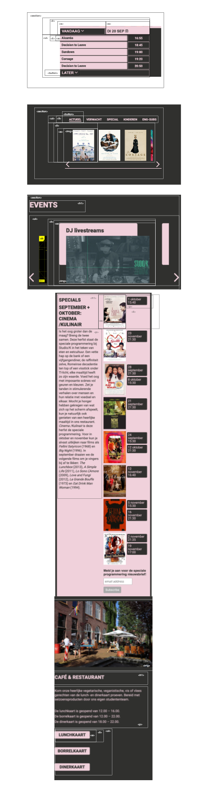

# Procesverslag
Markdown is een simpele manier om HTML te schrijven.
Markdown cheat cheet: [Hulp bij het schrijven van Markdown](https://github.com/adam-p/markdown-here/wiki/Markdown-Cheatsheet).

Nb. De standaardstructuur en de spartaanse opmaak van de README.md zijn helemaal prima. Het gaat om de inhoud van je procesverslag. Besteedt de tijd voor pracht en praal aan je website.

Nb. Door *open* toe te voegen aan een *details* element kun je deze standaard open zetten. Fijn om dat steeds voor de relevante stuk(ken) te doen.

## Jij

  
uitwerken voor kick-off werkgroep

  ### Auteur:
  Tess van der Sluis

  #### Je startniveau:
  blauw

  #### Je focus:
  Responsive

## Je website

  
uitwerken voor kick-off werkgroep

  ### Je opdracht:
  https://studio-k.nu

  #### Screenshot(s) van de eerste pagina (small screen):
  hier de naam van de pagina
  

  #### Screenshot(s) van de tweede pagina (small screen):
  hier de naam van de pagina
  

## Toegankelijkheidstest 1/2 (week 1)

  
uitwerken na test in 1e werkgroep

  ### Bevindingen
De site die ik heb uitgekozen is zeker geen slechte site. Toch zijn er hier en daar wat functies die ontbreken waardoor de site nog soepeler zou kunnen verlopen.

  #### Screenreader
  De screenreader doet het op opzich best goed. De kopjes hebben goede namen. Hier en daar worden er wel wat elementen overgeslagen.

  #### Muis en Toetsenbord
  De website is ged te besturen, de contrasten van de site werken goed voor blindheid.

  #### Motoriek (shocks, elastiekjes)
  Met de motoriek merk je dat de site op bepaalde punten niet een goede verdeling van informatie heeft. Waardoor je met een trillende hand niet heel ver komt. De agenda is bijvoorbeeld heel klein.

  #### Visueel (brillen, contrast, kleurenblind, dark/light).
  Met de verschillende brillen op werkt de site nog prima. Het contrast van het roze en zwart werkt goed. Het is wel jammer dat de lettergrote niet makkelijk kan worden veranderd.Ook zijn er hier en daar zinnen over afbeeldingen geplaatst wat er ook wel voor kan zorgen dat het minder goed te lezen is.

  Om de site te verbeteren:
  Een hover state toepassen
  een functie dat de letters groter en kleiner worden
  night modus toevoegen

## Breakdownschets (week 1)

  
uitwerken na afloop 2e werkgroep

  ### de hele pagina:
  

## Voortgang 1 (week 2)

  
uitwerken voor 1e voortgang

  ### Stand van zaken
  Is mijn website gevraieerd genoeg? En moet ik alles uitwerken zoals het op de site staat?

  ### Agenda voor meeting
  samen met je groepje opstellen

  - Maeve: wanneer weet je of iets een section is?
  - Nienke: Is mijn html semantisch
  
 

  ### Verslag van meeting
  hier na afloop snel de uitkomsten van de meeting vastleggen

  - Het formulier moet niet met 

  - Nog niet genoeg html 
  - Mijn read-me verder afmaken zoals breakdown schets 

 

## Voortgang 2 (week 3)

  
uitwerken voor 2e voortgang

  ### Stand van zaken
  hier dit ging goed & dit was lastig (neem ook screenshots op van delen van je website en code)
   
  - Mijn code goed semantisch schrijven vindt ik nog lastig. 
  Wanneer moeten er h1, h2 & h3?
  Hoe selecteer je de tweede section vanuit je main en daar de ul van?
  Hoe zorg je ervoor dat je header een backrgound image krijgt?

  ### Agenda voor meeting
  samen met je groepje opstellen
  
  - Maeve: Welke css selectors moet je gebruiken 
           En hoe deel je logisch je stylesheet in
           Mag je bij img id's gebruiken
  
  - Eliran: Moet je bij een page waar je de taal kan switchen een aparte 
           (vertaalde) page maken of gebruik je javascript om de text te veranderen?
  
  - Nienke: Hoe kan je de header centreren?
  
  - Thijs: Indeling van HTML nog lastig

  ### Verslag van meeting
  hier na afloop snel de uitkomsten van de meeting vastleggen

  - punt 1
  - punt 2
  - nog een punt
- ...

## Toegankelijkheidstest 2/2 (week 4)

  
uitwerken na test in 8e werkgroep

  ### Bevindingen
  Lijst met je bevindingen die in de test naar voren kwamen (geef ook aan wat er verbeterd is):

  #### Screenreader
  Hier korte omschrijving (met indien nodig afbeeldingen)

  Hier een omschrijving van hoe het opgelost kan worden (met indien nodig afbeeldingen)

  #### Muis en Toetsenbord
  Hier korte omschrijving (met indien nodig afbeeldingen)

  Hier een omschrijving van hoe het opgelost kan worden (met indien nodig afbeeldingen)

  #### Motoriek (shocks, elastiekjes)
  Hier korte omschrijving (met indien nodig afbeeldingen)

  Hier een omschrijving van hoe het opgelost kan worden (met indien nodig afbeeldingen)

  #### Visueel (brillen, contrast, kleurenblind, dark/light).
  Hier korte omschrijving (met indien nodig afbeeldingen)

  Hier een omschrijving van hoe het opgelost kan worden (met indien nodig afbeeldingen)

## Voortgang 3 (week 4)

  
uitwerken voor 3e voortgang

  ### Stand van zaken
  hier dit ging goed & dit was lastig (neem ook screenshots op van delen van je website en code)

  ### Agenda voor meeting
  samen met je groepje opstellen

  | student 1      | student 2          | student 3    | student 4        |
  | ---            | ---                | ---          | ---              |
  | dit bespreken  | en dit             | en ik dit    | en dan ik dat    |
  | en dat ook nog | dit als er tijd is | nog een punt | dit wil ik zeker |
  | ...            | ...                | ...          | ...              |

  ### Verslag van meeting
  hier na afloop snel de uitkomsten van de meeting vastleggen

  - punt 1
  - punt 2
  - nog een punt
  - ...

## Eindgesprek (week 5)

  
uitwerken voor eindgesprek

  ### Je uitkomst - karakteristiek screenshots:
  

  ### Dit ging goed/Heb ik geleerd:
  Korte omschrijving met plaatjes

  

  ### Dit was lastig/Is niet gelukt:
  Korte omschrijving met plaatjes

  

## Bronnenlijst

  
continu bijhouden terwijl je werkt

  Nb. Wees specifiek ('css-tricks' als bron is bijv. niet specifiek genoeg).

  1. bron 1
  2. bron 2
  3. ...

